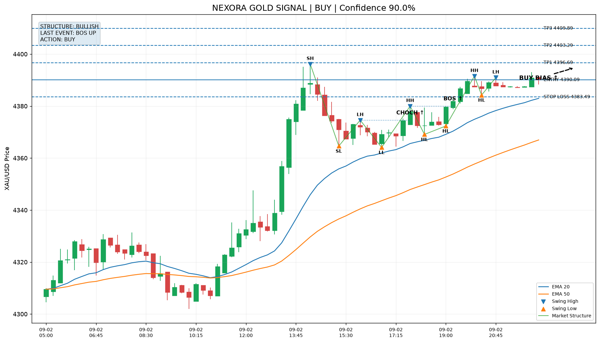

# Nexora Trading Automation

Nexora is an experimental trading automation and research system focused on structured market analysis, risk controls, monitoring, historical testing, and platform integration.

It is presented here as a technical case study, not as a profitability claim or trading recommendation.

## What the system explores

- Multi-timeframe market analysis
- Automated signal evaluation
- Rule-based risk controls
- Historical testing and research workflows
- Telegram monitoring and reporting
- Trading-platform integrations
- Logged and reproducible analysis
- Safety gates before execution

## Technology

- Python
- MetaTrader 5
- cTrader integrations
- Telegram automation
- Historical testing pipelines
- Market-data research workflows

## Example Signal Analysis

## Engineering Focus

The project is designed around repeatable research and automation rather than manual trade decisions.

The workflow separates:

1. Market data collection
2. Signal generation
3. Validation
4. Risk checks
5. Monitoring
6. Historical evaluation

## Safety Design

Execution-related components use explicit safety controls such as position limits, risk checks, account-mode validation, and test-oriented execution gates.

Sensitive credentials, account details, tokens, broker configuration, private logs, and execution code are intentionally excluded from this public case study.

## Project Status

Active research and development.

Results from historical tests are treated as research evidence only and do not imply future profitability.
